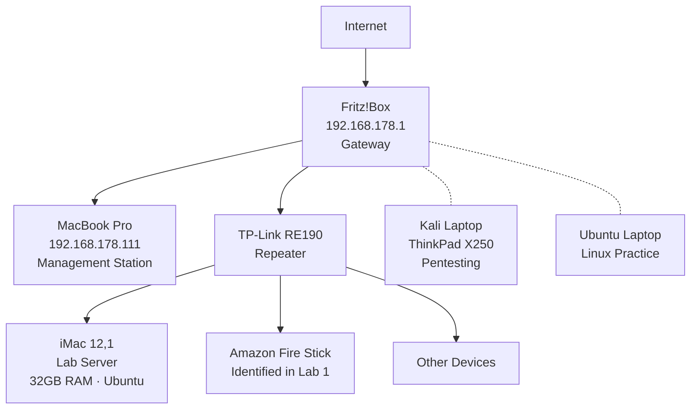

# homelab-foundation


## About

Hands-on networking and cybersecurity foundation labs.
Built alongside CompTIA studies to develop practical skills in network analysis, traffic inspection, wireless security, and network defense.

This repository covers **foundational skills** — the building blocks before advanced attack/defense scenarios.

> Advanced scenarios continue in **Operation Crimson Gate** *(coming soon)*

---

## Certifications

- CompTIA A+ ✅
- CompTIA Security+ ✅
- CompTIA Network+ *(in progress)*

---

## Network Architecture



---

## Lab Environment

| Machine | Specs | OS | Role |
|:--------|:------|:---|:-----|
| MacBook Pro | 16GB RAM · 500GB SSD | macOS | Management station — scanning, documentation, analysis |
| iMac 12,1 | 32GB RAM · 500GB HDD | Ubuntu | Lab server — network services, security tools |
| Kali Laptop | ThinkPad X250 | Kali Linux 6.18 | Pentesting & red team exercises |
| Ubuntu Laptop | — | Ubuntu | Additional workstation |
| Fritz!Box | — | — | Network gateway, DHCP, DNS |
| TP-Link RE190 | — | — | Wi-Fi repeater — discovered via MAC analysis in Lab 0 |
| TP-Link Archer T2U Plus | RTL8821AU | — | External WiFi adapter — monitor mode & packet injection |

---

## Labs

| # | Lab | Tools | Key Skills | Status |
|---|-----|-------|------------|--------|
| 0 | [Network Discovery](Lab0_Network_Discovery/) | ifconfig, arp, nmap, ping | Network topology mapping, port scanning, MAC analysis, security assessment | ✅ |
| 1 | [Wireshark Traffic Analysis](Lab1_Wireshark_Traffic_Analysis/) | Wireshark, curl, ping, nslookup | Protocol analysis (ICMP/DNS/HTTP/ARP/TLS), TCP lifecycle, JA3 fingerprinting, passive device ID | ✅ |
| 2 | [WiFi Security](Lab2_WiFi_Security/) | aircrack-ng suite, hcxdumptool, hashcat, macchanger | WPA2 handshake capture, PMKID attack, deauth, MAC spoofing, offline cracking | ✅ |
| 3 | Firewall & Segmentation | iptables/nftables | ACLs, traffic filtering, network zones, segmentation | 🔜 |

---

## Cross-Lab Discoveries

- **Lab 0 → Lab 1:** Unknown device (192.168.178.97) identified as Amazon Fire Stick through Wireshark passive traffic analysis (UPnP + Spotify Connect traffic)
- **Lab 0 → Lab 1:** Repeater MAC behavior confirmed across both active scanning (nmap) and passive capture (Wireshark ARP analysis)
- **Lab 1 → Lab 2:** Wireshark deauth frame analysis (`wlan.fc.type_subtype == 0x000c`) directly applicable to WiFi attack detection

---

## Privacy & Ethics

- All IP addresses are RFC 1918 private addresses — not routable from the internet
- Hostnames anonymized to protect device owners
- MAC addresses partially redacted where not essential
- No credentials or sensitive data included in documentation
- Capture files stored locally, not uploaded to repository
- **All WiFi lab activities performed on own network only — BSSID filter applied at all times to prevent capturing third-party networks**

---

## Roadmap

```
homelab-foundation          ← you are here
└── Foundation skills complete

operation-crimson-gate-01   ← coming soon
└── Enterprise network simulation
```

---

*Started from zero. 3 exams in 5 months. Still learning, still building — every lab teaches something new.*
