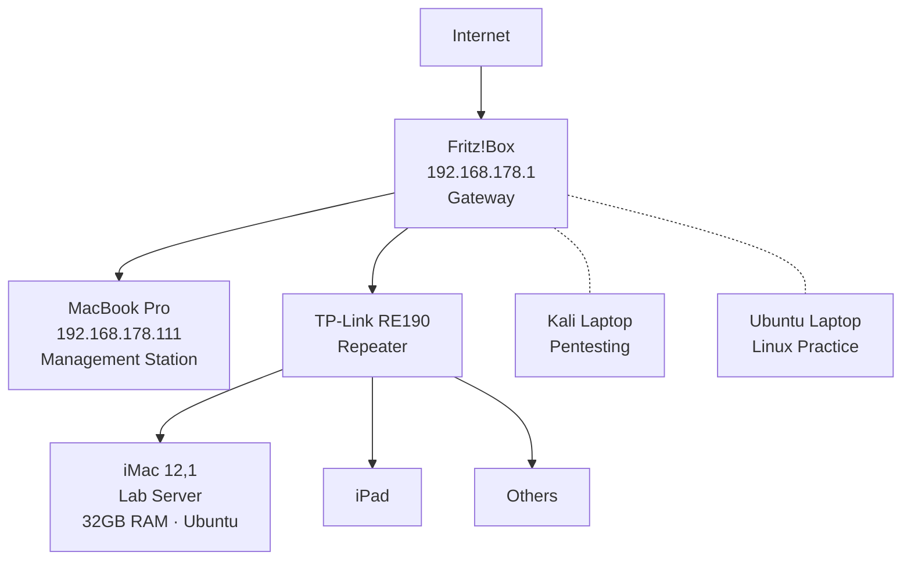

# Home Lab Projects

## About 

Hands-on networking and cybersecurity lab projects.
Built alongside CompTIA Net+ studies to develop practical skills.

## Network Architecture :

## Lab Environment      
- MacBook Pro 16GB RAM, 500GB SSD (management station)
- iMac 12,1 (Mid 2011) 32GB RAM, 500GB HDD, Ubuntu (lab server)
- Fritz!Box Router (home network)

## Projects
| # | Project | Status | Topics Covered |
|---|---------|--------|----------------|
| 0 | Network Discovery | in progress | IP addressing, network topology, scanning |
