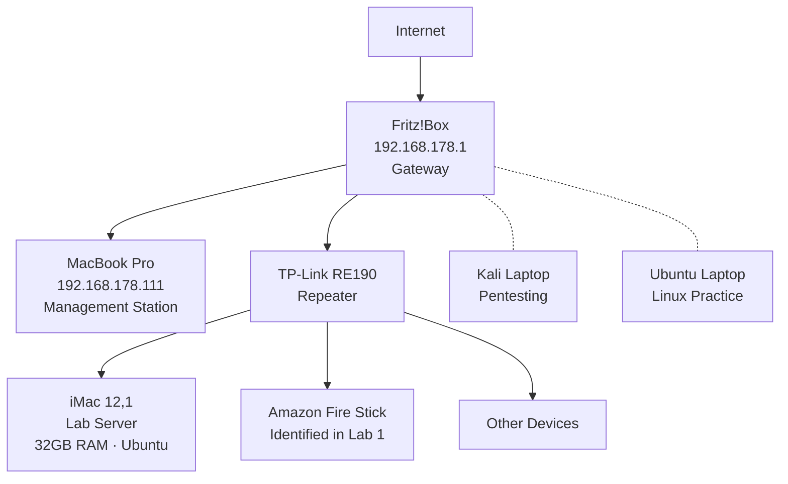

# Home Lab Projects

## About 
Hands-on networking and cybersecurity lab projects.
Built alongside CompTIA Net+ studies to develop practical skills
in network analysis, traffic inspection, and security assessment.

## Certifications
- CompTIA A+ ✅
- CompTIA Security+ ✅
- CompTIA Network+ (in progress)

## Network Architecture

## Lab Environment      
| Machine | Specs | OS | Role |
|:--------|:------|:---|:-----|
| MacBook Pro | 16GB RAM · 500GB SSD | macOS | Management station — scanning, documentation, analysis |
| iMac 12,1 | 32GB RAM · 500GB HDD | Ubuntu | Lab server — VMs, network services, security tools |
| Kali Laptop | — | Kali Linux | Pentesting & red team exercises |
| Ubuntu Laptop | — | Ubuntu | Additional workstation |
| Fritz!Box | — | — | Network gateway, DHCP, DNS |
| TP-Link RE190 | — | — | Wi-Fi repeater — discovered via MAC analysis in Lab 0 |

## Projects

| # | Project | Tools Used | Key Findings | Status |
|---|---------|-----------|--------------|--------|
| 0 | [Network Discovery](Lab0_Network_Discovery/) | ifconfig, arp, nmap, ping | Mapped full topology, identified repeater via MAC analysis, port scanned Fritz!Box (9 open ports) vs iMac (0 open ports), security assessment | ✅ |
| 1 | [Wireshark Traffic Analysis](Lab1_Wireshark_Traffic_Analysis/) | Wireshark, curl, ping, nslookup | Analyzed 5 protocols (ICMP/DNS/HTTP/ARP/TLS), TCP lifecycle, HTTP vs HTTPS comparison, cipher negotiation, JA3 fingerprinting, passive device identification | ✅ |
| 2 | Firewall & Segmentation | pfSense/OPNsense | ACLs, traffic filtering, network zones | 🔜 |
| 3 | SIEM & Log Analysis | Graylog/Wazuh | Log collection, alert triage, detection rules | 🔜 |
| 4 | AWS Cloud Security | AWS Console | VPC design, security groups, IAM, CloudTrail | 🔜 |

## Cross-Lab Discoveries
- **Lab 0 → Lab 1:** Unknown device (192.168.178.97) identified as Amazon Fire Stick through Wireshark passive traffic analysis (UPnP + Spotify Connect traffic)
- **Lab 0 → Lab 1:** Repeater MAC behavior confirmed across both active scanning (nmap) and passive capture (Wireshark ARP analysis)

## Privacy Considerations
- All IP addresses are RFC 1918 private addresses — not routable from the internet
- Hostnames anonymized to protect device owners
- MAC addresses partially redacted where not essential
- No credentials or sensitive data included in documentation
- Capture files stored locally, not uploaded to repository
